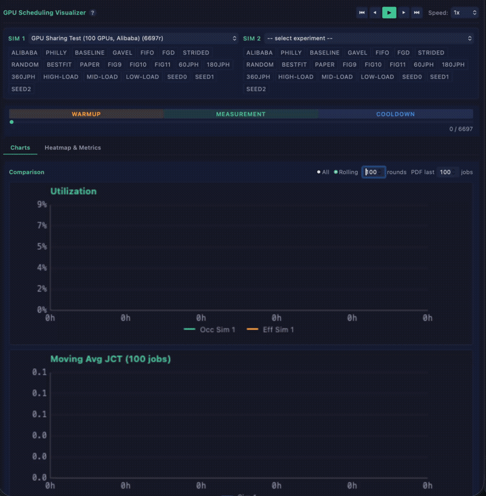
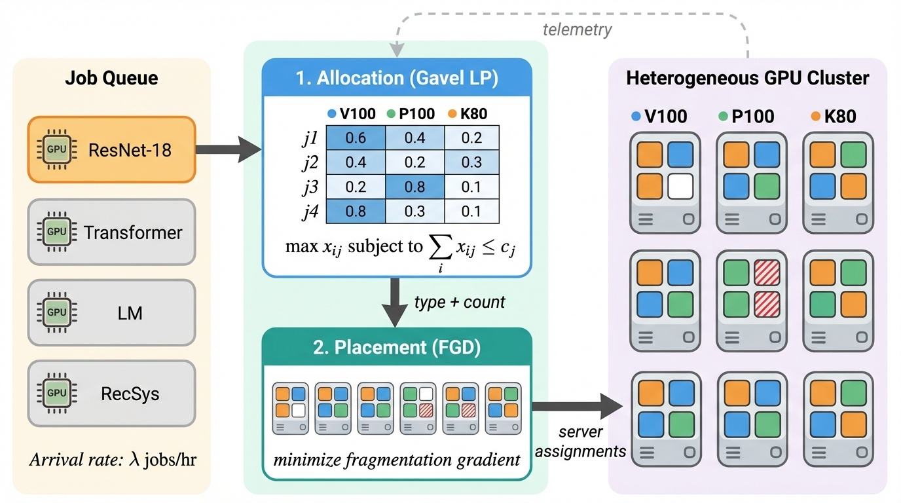
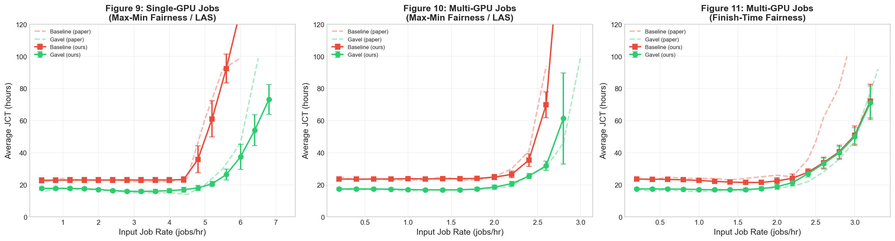
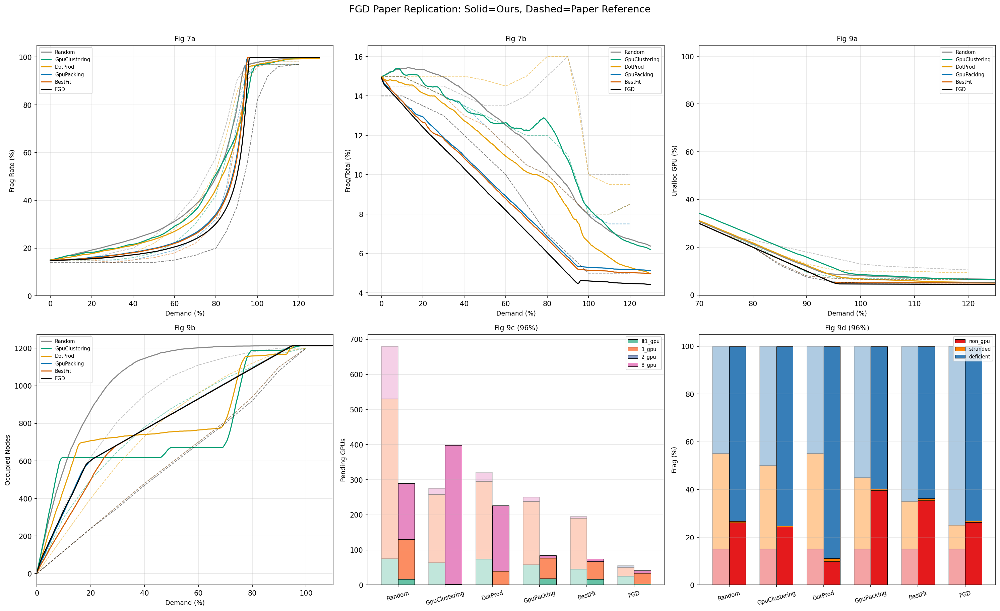
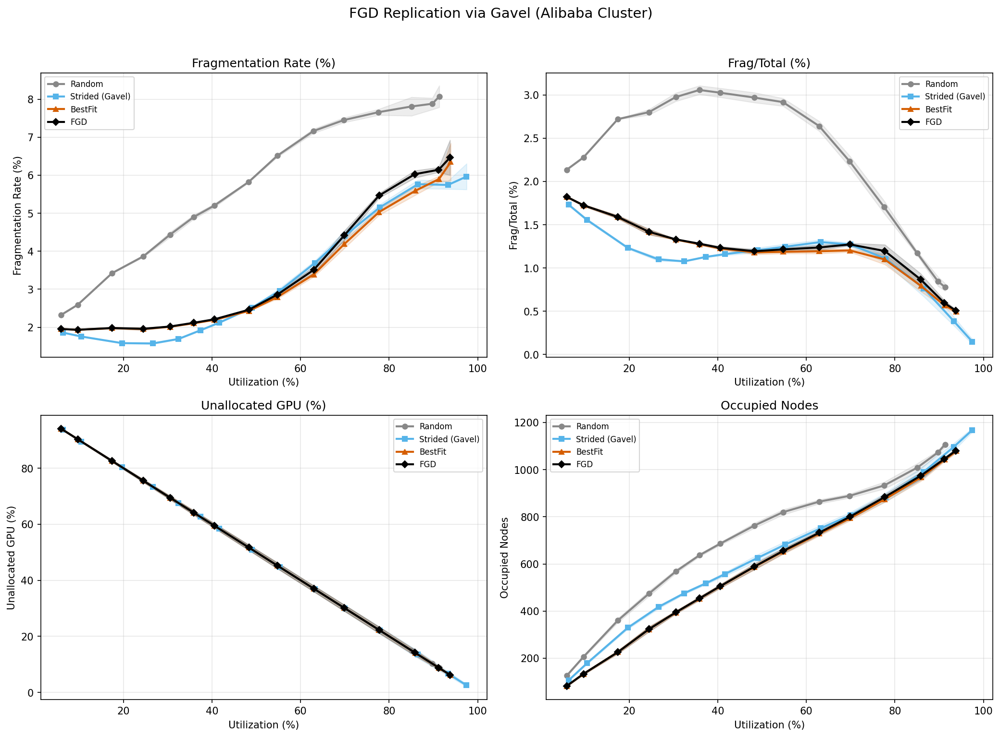
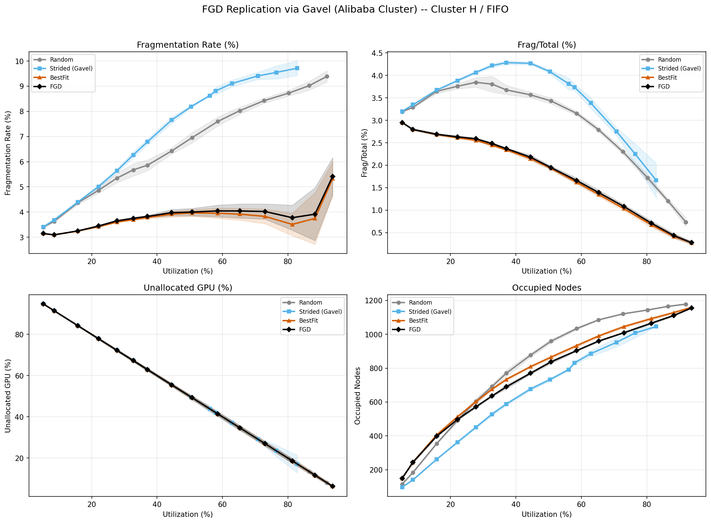
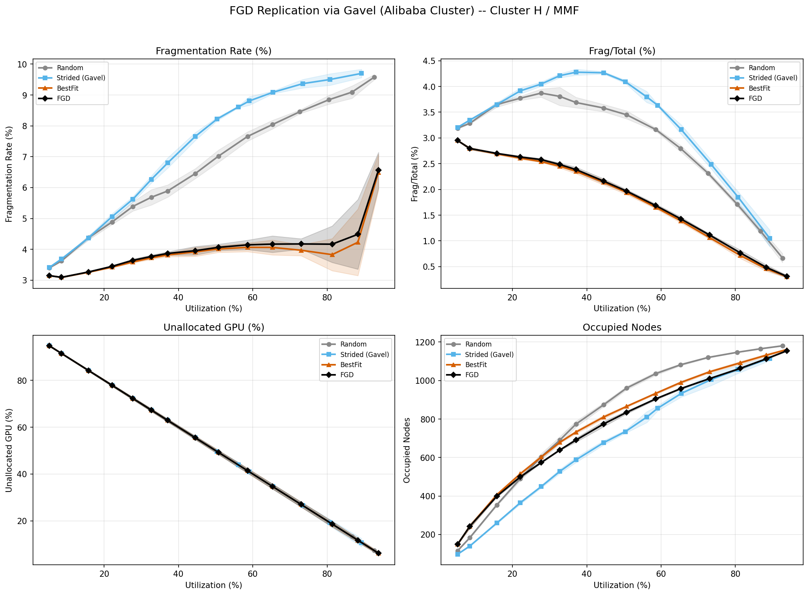

# Gavel + FGD: Heterogeneity-Aware Scheduling with Fragmentation-Aware Placement



**CS244C -- Advanced Topics in Networking (Winter 2026)**
Stanford University

**Team:** Jiayu Chang, Stefan Ene, Hyeonggyu Kim, Varun Ramesh

**Papers replicated:**
- [Gavel: Heterogeneity-Aware Cluster Scheduling Policies for Deep Learning Workloads (OSDI 2020)](https://www.usenix.org/conference/osdi20/presentation/narayanan-deepak)
- [Beware of Fragmentation: Scheduling GPU-Sharing Workloads with Fragmentation Gradient Descent (ATC 2023)](https://www.usenix.org/conference/atc23/presentation/weng)

---

## Overview

GPU cluster schedulers face two complementary challenges: **heterogeneity** (allocating the right GPU type and quantity to each job) and **fragmentation** (placing jobs on servers without creating unusable GPU fragments). Gavel solves the first problem with an effective throughput abstraction and max-min fairness LP. FGD solves the second with fragmentation gradient descent for server-level placement.

This project replicates both papers independently, then integrates FGD's placement algorithm into Gavel's scheduling loop. We evaluate the combined system on both the original Philly trace (108 GPUs, 3 types) and Alibaba's production cluster trace (up to 6,200 GPUs, 12 types).

**Key findings:**
- Gavel replication closely matches the published Figs 9, 10, and 11 for average JCT across load levels
- FGD standalone replication reproduces the correct ordering of placement strategies (FGD < BestFit < Random)
- Cluster topology matters more than algorithm choice: uniform node sizes (Alibaba split) produce only 2-8% fragmentation regardless of placement strategy, while mixed node sizes (Cluster H) produce the expected differentiation between strategies
- The packed max-min fairness policy does not scale beyond ~50 active jobs due to O(n^2) job-pair throughput tensors

## Architecture

Each scheduling round has two phases: Gavel's LP determines GPU type and count allocations, then FGD selects specific servers to minimize fragmentation.



## Results

### Gavel Replication (Figs 9, 10, 11)

108-GPU heterogeneous cluster (36 V100 + 36 P100 + 36 K80), Philly trace. 312 experiments across 3 policies, 3 seeds, and full arrival rate sweeps.

Solid lines = our replication, dashed lines = paper reference curves:



### FGD Standalone Replication

Alibaba Cluster H (1,200 nodes, 5,592 GPUs, mixed node sizes 1/2/4/8 GPUs). Inflation-based evaluation with 6 placement strategies.



### FGD via Gavel -- Alibaba Split Cluster

6,200-GPU heterogeneous cluster with 12 sub-types, uniform node sizes per type. 45 experiments (5 policies x 3 rates x 3 seeds).



Key finding: fragmentation stays at 2-8% for all placement strategies because uniform node sizes eliminate the packing problem that FGD is designed to solve.

### FGD via Gavel -- Cluster H (Mixed Node Sizes)

5,592-GPU single-type cluster with mixed node sizes (462x8-GPU + 310x4-GPU + 228x2-GPU + 200x1-GPU). 360 experiments (2 policies x 4 placements x 15 rates x 3 seeds).

| FIFO Policy | Max-Min Fairness |
|:-----------:|:----------------:|
|  |  |

With mixed node sizes, the expected ordering emerges: FGD < BestFit < Strided < Random for fragmentation rate.

## Reproducing Results

### Prerequisites

- macOS or Linux (tested on macOS 14, Apple Silicon)
- Python 3.9+

### Local Setup

```bash
git clone https://github.com/Turquoise-T/cs244c-GPU_fragment.git
cd cs244c-GPU_fragment

python3 -m venv .venv
source .venv/bin/activate
pip install -r requirements-sim.txt

# Enable pre-commit hooks (runs unit + integration tests)
git config core.hooksPath .githooks
```

### Run Tests

```bash
# Unit tests (15 tests, ~0.1s)
cd src/scheduler/tests
python -m unittest policies_tests -v

# Integration test (deterministic JCT check, ~3s)
python -m unittest integration_test -v
```

The integration test verifies deterministic output for a fixed config (36:36:36 cluster, 50 jobs, seed=0). Expected average JCT = 57,171.41s. Any deviation indicates a regression.

### Run a Single Experiment

```bash
cd src/scheduler
python scripts/sweeps/run_sweep_static.py \
  --throughputs-file simulation_throughputs.json \
  --cluster-spec 4:4:4 \
  --policies fifo \
  --num-total-jobs-lower-bound 10 \
  --num-total-jobs-upper-bound 10 \
  --num-data-points 1 \
  --seeds 42 \
  --log-dir /tmp/gavel_test \
  -v
```

### Running on FarmShare (SLURM)

For full-scale experiments, use Stanford's FarmShare cluster:

```bash
# Sync code
rsync -avz --exclude='.venv' --exclude='__pycache__' --exclude='results*' \
    ./ farmshare:~/gavel/

# Submit Gavel replication (312 experiments)
ssh farmshare "cd ~/gavel/experiments/gavel-replication && sbatch slurm/submit_full.sbatch"

# Submit FGD replication -- Cluster H (360 experiments)
ssh farmshare "cd ~/gavel/experiments/combined && sbatch slurm/submit_fgd_replication_cluster_h.sbatch"

# Check status
ssh farmshare "squeue -u \$USER"
```

### Generating Figures

```bash
# Gavel replication overlay (Figs 9/10/11)
cd experiments/gavel-replication
python scripts/plot_results.py

# FGD replication comparison
cd experiments/combined
python scripts/plot_fgd_replication.py
```

## Project Structure

```
.
├── src/
│   ├── scheduler/              # Core scheduler code
│   │   ├── scheduler.py        # Simulation loop with telemetry + profiling
│   │   ├── policies/           # Scheduling policies (FIFO, LAS, MMF, FTF, etc.)
│   │   ├── job.py              # Job model with migration time estimation
│   │   ├── utils.py            # Policy registry + helpers
│   │   ├── traces/             # Philly trace data
│   │   ├── simulation_throughputs.json       # Philly cluster throughputs
│   │   ├── simulation_throughputs_cluster_h.json  # Cluster H throughputs
│   │   └── tests/              # Unit + integration tests
│   └── fgd/                    # FGD core algorithm
│       ├── fgd_placement.py    # Fragmentation gradient descent placement
│       └── data/               # Alibaba cluster topology + trace data
│
├── experiments/
│   ├── gavel-replication/      # Gavel paper Figs 9, 10, 11
│   │   ├── configs/            # 312 experiment configurations
│   │   ├── results/            # Per-experiment JSON results
│   │   ├── figures/            # Replication + comparison plots
│   │   ├── scripts/            # Runner, config generators, plotting
│   │   └── slurm/              # SLURM batch scripts
│   ├── combined/               # FGD+Gavel integrated experiments
│   │   ├── configs/            # Alibaba split, FIFO, Cluster H configs
│   │   ├── results/            # Per-config result directories
│   │   ├── figures/            # Comparison plots per config
│   │   ├── scripts/            # Plotting + config generation
│   │   ├── telemetry/          # Per-experiment JSONL telemetry
│   │   └── slurm/              # SLURM batch scripts
│   └── fgd-standalone/         # Standalone FGD evaluation
│       ├── figures/            # Replication plots
│       └── paper_reference_curves.json
│
├── docs/                       # Design documents and plans
├── scripts/                    # Shared utilities (sync, compression)
└── requirements-sim.txt        # Python dependencies
```

## References

- Narayanan et al., "Gavel: Heterogeneity-Aware Cluster Scheduling Policies for Deep Learning Workloads," OSDI 2020
- Weng et al., "Beware of Fragmentation: Scheduling GPU-Sharing Workloads with Fragmentation Gradient Descent," ATC 2023
- [Alibaba GPU Cluster Trace (cluster-trace-gpu-v2023)](https://github.com/alibaba/clusterdata)
- [Microsoft Philly Trace](https://github.com/msr-fiddle/philly-traces)
- [Original Gavel Repository](https://github.com/stanford-futuredata/gavel)
