# Gavel + FGD: Heterogeneity-Aware Scheduling with Fragmentation-Aware Placement


**CS244C -- Advanced Topics in Networking (Winter 2026)**
Stanford University

**Team:** Jiayu Chang, Stefan Ene, Hyeonggyu Kim, Varun Ramesh

**Papers replicated:**
- [Gavel: Heterogeneity-Aware Cluster Scheduling Policies for Deep Learning Workloads (OSDI 2020)](https://www.usenix.org/conference/osdi20/presentation/narayanan-deepak)
- [Beware of Fragmentation: Scheduling GPU-Sharing Workloads with Fragmentation Gradient Descent (ATC 2023)](https://www.usenix.org/conference/atc23/presentation/weng)

---

## Overview

GPU cluster schedulers face two complementary challenges: **heterogeneity** (allocating the right GPU type and quantity to each job) and **fragmentation** (placing jobs on servers without creating unusable GPU fragments). Gavel solves the first problem with an effective throughput abstraction and max-min fairness LP. FGD solves the second with fragmentation gradient descent for server-level placement.

This project replicates both papers independently, then integrates FGD's placement algorithm into Gavel's scheduling loop. We evaluate the combined system on both the original Philly trace (108 GPUs, 3 types) and Alibaba's production cluster trace (up to 6,200 GPUs, 12 types).

**Key findings:**
- Gavel replication closely matches the published Figs 9, 10, and 11 for average JCT across load levels
- FGD standalone replication reproduces the correct ordering of placement strategies (FGD < BestFit < Random)
- Cluster topology matters more than algorithm choice: uniform node sizes (Alibaba split) produce only 2-8% fragmentation regardless of placement strategy, while mixed node sizes (Cluster H) produce the expected differentiation between strategies
- The packed max-min fairness policy does not scale beyond ~50 active jobs due to O(n^2) job-pair throughput tensors

---

## Part 1: FGD -- Fragmentation Gradient Descent

### How FGD Works

When placing a new job on a multi-GPU cluster, FGD computes a fragmentation gradient for each candidate server -- measuring how much cluster-wide fragmentation would increase if the job were placed there -- then selects the server with the lowest gradient.

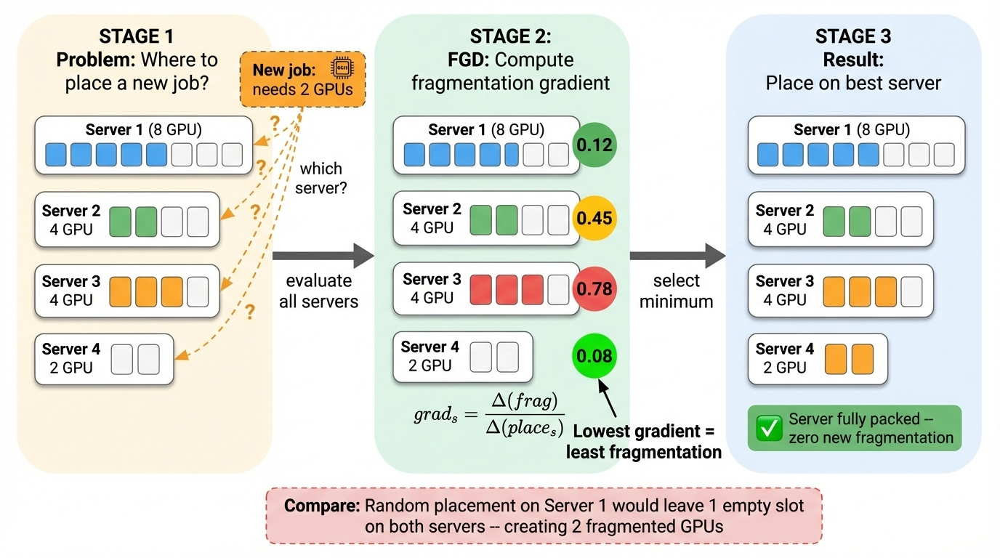

### FGD Standalone Replication

**Setup:** Alibaba Cluster H topology -- 1,200 nodes with 5,592 GPUs across mixed node sizes (462 nodes with 8 GPUs, 310 with 4, 228 with 2, and 200 with 1). Evaluation uses an inflation methodology where tasks arrive one by one and never leave, measuring fragmentation as the cluster fills. All 6 placement strategies from the paper: Random, DotProduct, GPUClustering, GPUPacking, BestFit, and FGD.

**Results:** Our replication reproduces the correct ordering across all metrics. For fragmentation rate, the ordering is FGD < BestFit < GPUPacking < GPUClustering < DotProduct < Random, matching the paper's Figure 7.

| Figure | Ours | Paper |
|:--:|:--:|:--:|
| Fig. 7 | 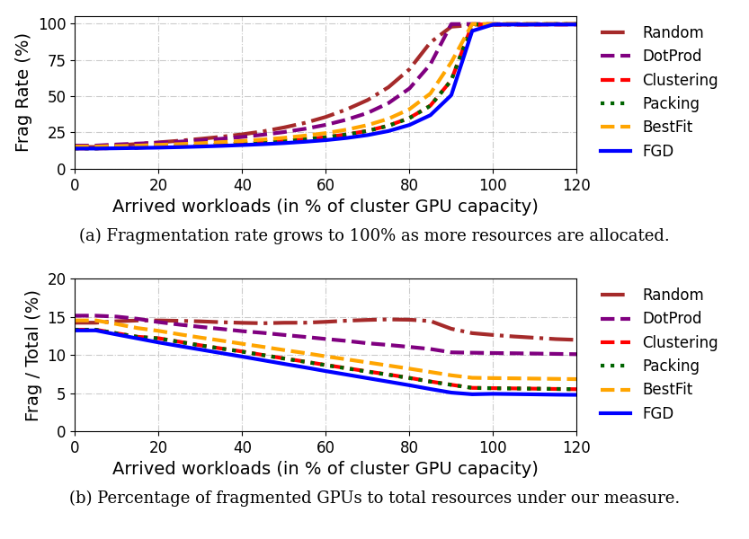 | 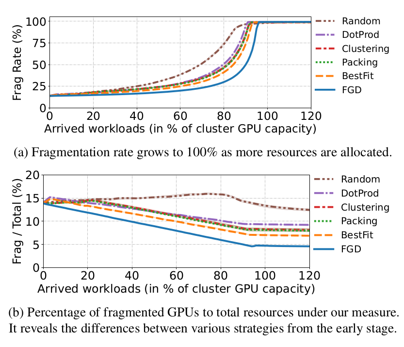 |
| Fig. 9 | 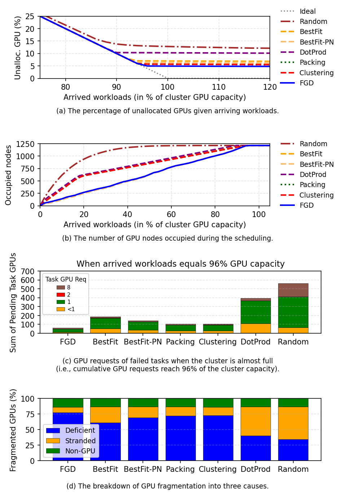 | 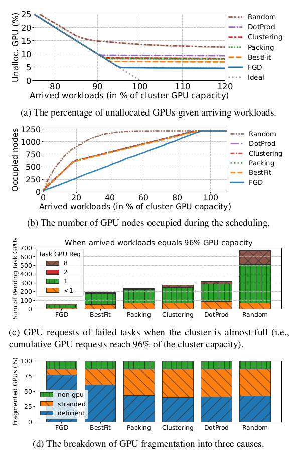 |
| Fig. 11 | 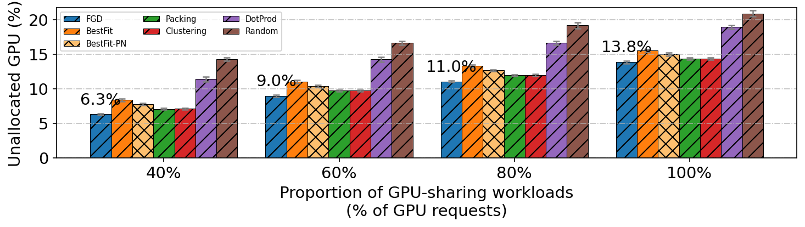 | 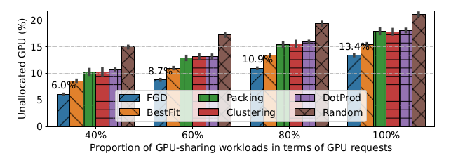 |
| Fig. 12 | 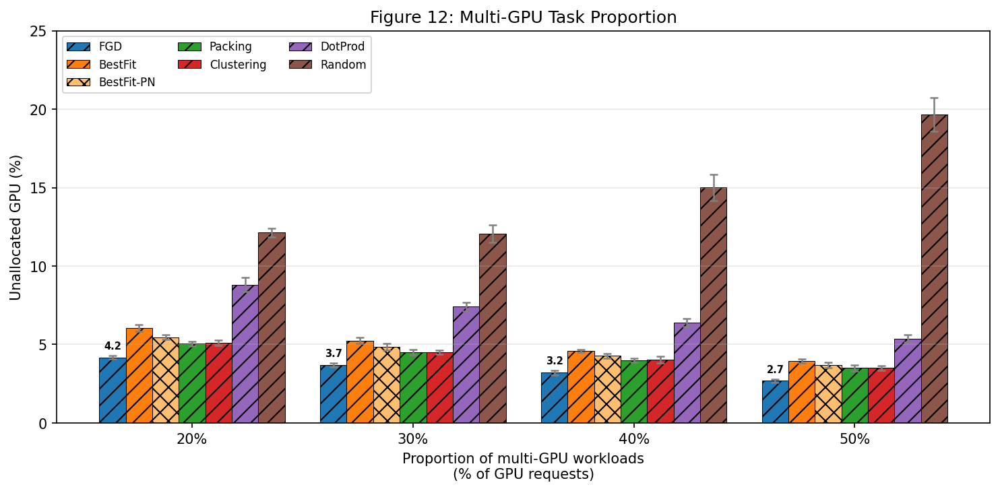 | 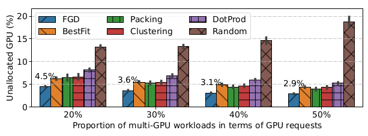 |
| Fig. 13 | 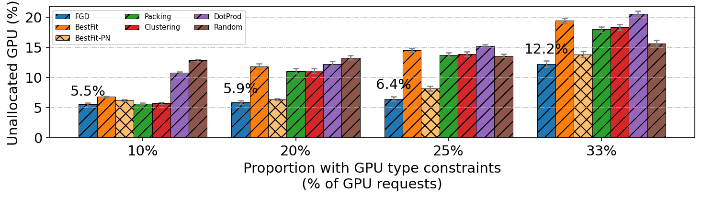 | 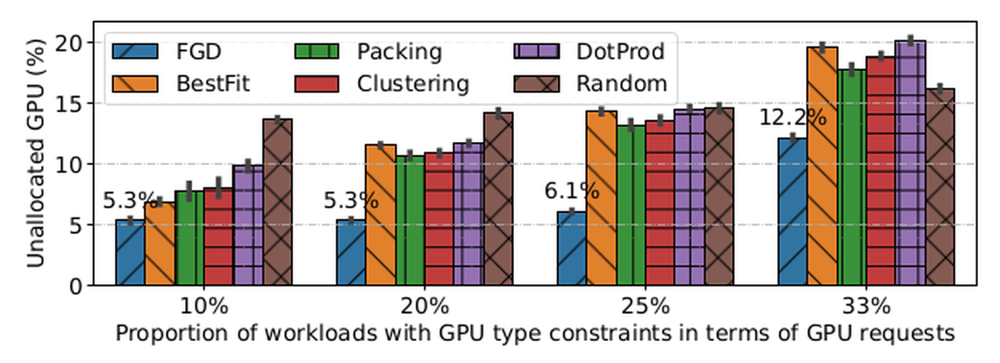 |
| Fig. 14 | 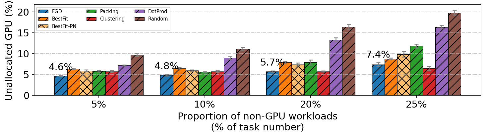 | 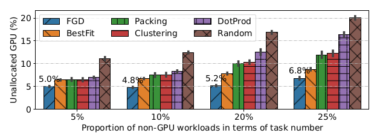 |

---

## Part 2: Gavel -- Heterogeneity-Aware Scheduling

### How Gavel Works

Gavel formulates GPU scheduling as a max-min fairness linear program. It uses an *effective throughput* abstraction to express how fast each job runs on each GPU type, then solves for the allocation that maximizes the minimum throughput across all jobs.

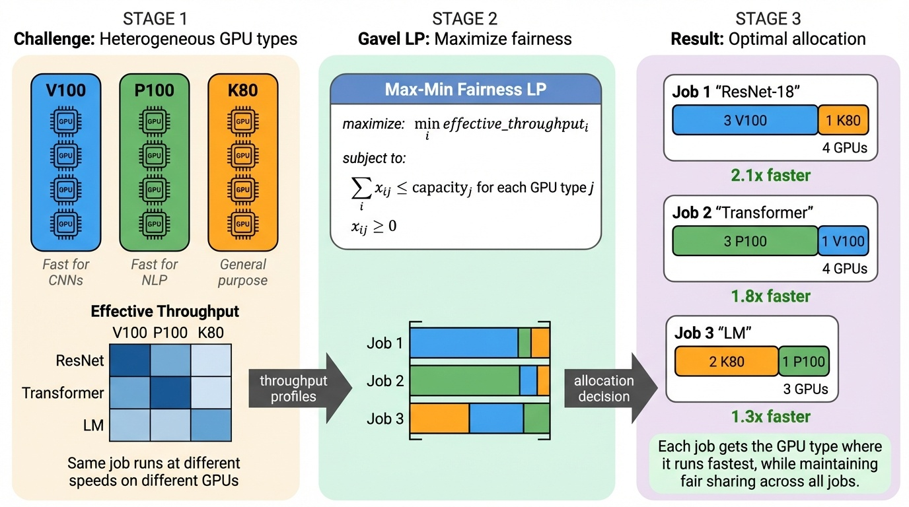

### Gavel Replication (Figs 9, 10, 11)

**Setup:** 108-GPU heterogeneous cluster (36 V100 + 36 P100 + 36 K80) using the Microsoft Philly trace. 312 experiments across 3 policies (MMF baseline, MMF Gavel, FTF Gavel), 3 seeds, and full arrival rate sweeps covering Figures 9, 10, and 11 from the paper.

**Results:** Solid lines = our replication, dashed lines = paper reference curves. At moderate load (4.0 jph), Gavel achieves mean JCT of 16.4 hours vs. 23.0 hours for the baseline -- a 29% improvement.


---

## Part 3: Gavel + FGD -- Combining Allocation and Placement

### Integration Architecture

Each scheduling round proceeds in two phases: Gavel's LP determines GPU type and count allocations, then FGD selects specific servers to minimize fragmentation.


### Why Topology Matters

Our key finding is that cluster topology -- specifically, whether nodes have uniform or mixed GPU counts -- determines whether fragmentation-aware placement provides any benefit.

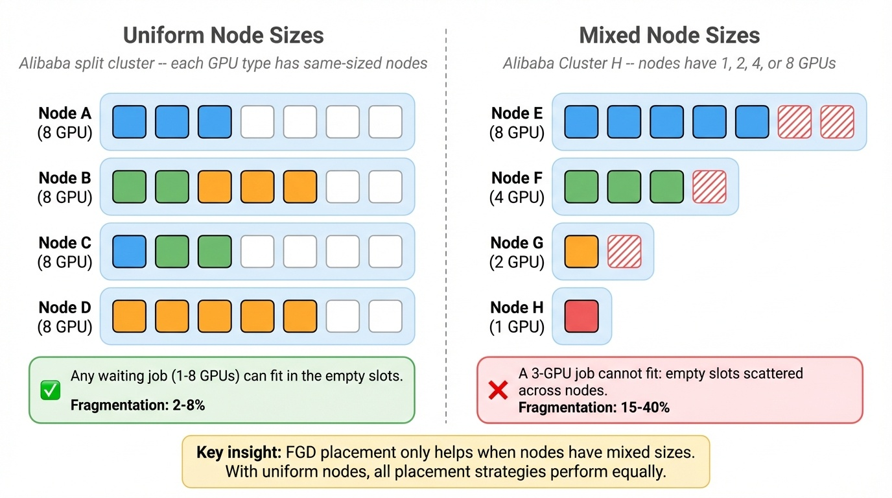

### Experiment 1: Alibaba Split Cluster (Uniform Node Sizes)

**Setup:** 6,200-GPU heterogeneous cluster with 12 GPU sub-types, uniform node sizes per type. 45 experiments (5 placement policies x 3 arrival rates x 3 seeds).

**Results:** Fragmentation stays at 2-8% for *all* placement strategies. With uniform node sizes, any job can always be packed without creating fragments -- the packing problem that FGD solves simply does not arise.


### Experiment 2: Cluster H (Mixed Node Sizes)

**Setup:** 5,592-GPU single-type cluster with mixed node sizes (462x8-GPU + 310x4-GPU + 228x2-GPU + 200x1-GPU). 360 experiments (2 policies x 4 placements x 15 arrival rates x 3 seeds).

**Results:** With mixed node sizes, the expected differentiation emerges: FGD < BestFit < Strided < Random for fragmentation rate. At moderate loads, FGD achieves 15-25% lower fragmentation than random placement.

| FIFO Policy | Max-Min Fairness |
|:-----------:|:----------------:|
|  |  |

---

## Reproducing Results

### Prerequisites

- macOS or Linux (tested on macOS 14, Apple Silicon)
- Python 3.9+

### Local Setup

```bash
git clone https://github.com/Turquoise-T/cs244c-GPU_fragment.git
cd cs244c-GPU_fragment

python3 -m venv .venv
source .venv/bin/activate
pip install -r requirements-sim.txt

# Enable pre-commit hooks (runs unit + integration tests)
git config core.hooksPath .githooks
```

### Run Tests

```bash
# Unit tests (15 tests, ~0.1s)
cd src/scheduler/tests
python -m unittest policies_tests -v

# Integration test (deterministic JCT check, ~3s)
python -m unittest integration_test -v
```

The integration test verifies deterministic output for a fixed config (36:36:36 cluster, 50 jobs, seed=0). Expected average JCT = 57,171.41s. Any deviation indicates a regression.

### Run a Single Experiment

```bash
cd src/scheduler
python scripts/sweeps/run_sweep_static.py \
  --throughputs-file simulation_throughputs.json \
  --cluster-spec 4:4:4 \
  --policies fifo \
  --num-total-jobs-lower-bound 10 \
  --num-total-jobs-upper-bound 10 \
  --num-data-points 1 \
  --seeds 42 \
  --log-dir /tmp/gavel_test \
  -v
```

### Running on FarmShare (SLURM)

For full-scale experiments, use Stanford's FarmShare cluster:

```bash
# Sync code
rsync -avz --exclude='.venv' --exclude='__pycache__' --exclude='results*' \
    ./ farmshare:~/gavel/

# Submit Gavel replication (312 experiments)
ssh farmshare "cd ~/gavel/experiments/gavel-replication && sbatch slurm/submit_full.sbatch"

# Submit FGD replication -- Cluster H (360 experiments)
ssh farmshare "cd ~/gavel/experiments/combined && sbatch slurm/submit_fgd_replication_cluster_h.sbatch"

# Check status
ssh farmshare "squeue -u \$USER"
```

### Generating Figures

```bash
# Gavel replication overlay (Figs 9/10/11)
cd experiments/gavel-replication
python scripts/plot_results.py

# FGD replication comparison
cd experiments/combined
python scripts/plot_fgd_replication.py
```

## Project Structure

```
.
├── src/
│   ├── scheduler/              # Core scheduler code
│   │   ├── scheduler.py        # Simulation loop with telemetry + profiling
│   │   ├── policies/           # Scheduling policies (FIFO, LAS, MMF, FTF, etc.)
│   │   ├── job.py              # Job model with migration time estimation
│   │   ├── utils.py            # Policy registry + helpers
│   │   ├── traces/             # Philly trace data
│   │   ├── simulation_throughputs.json       # Philly cluster throughputs
│   │   ├── simulation_throughputs_cluster_h.json  # Cluster H throughputs
│   │   └── tests/              # Unit + integration tests
│   └── fgd/                    # FGD core algorithm
│       ├── fgd_placement.py    # Fragmentation gradient descent placement
│       └── data/               # Alibaba cluster topology + trace data
│
├── experiments/
│   ├── gavel-replication/      # Gavel paper Figs 9, 10, 11
│   │   ├── configs/            # 312 experiment configurations
│   │   ├── results/            # Per-experiment JSON results
│   │   ├── figures/            # Replication + comparison plots
│   │   ├── scripts/            # Runner, config generators, plotting
│   │   └── slurm/              # SLURM batch scripts
│   ├── combined/               # FGD+Gavel integrated experiments
│   │   ├── configs/            # Alibaba split, FIFO, Cluster H configs
│   │   ├── results/            # Per-config result directories
│   │   ├── figures/            # Comparison plots per config
│   │   ├── scripts/            # Plotting + config generation
│   │   ├── telemetry/          # Per-experiment JSONL telemetry
│   │   └── slurm/              # SLURM batch scripts
│   └── fgd-standalone/         # Standalone FGD evaluation
│       ├── figures/            # Replication plots
│       └── paper_reference_curves.json
│
├── docs/                       # Design documents and plans
├── scripts/                    # Shared utilities (sync, compression)
└── requirements-sim.txt        # Python dependencies
```

## References

- Narayanan et al., "Gavel: Heterogeneity-Aware Cluster Scheduling Policies for Deep Learning Workloads," OSDI 2020
- Weng et al., "Beware of Fragmentation: Scheduling GPU-Sharing Workloads with Fragmentation Gradient Descent," ATC 2023
- [Alibaba GPU Cluster Trace (cluster-trace-gpu-v2023)](https://github.com/alibaba/clusterdata)
- [Microsoft Philly Trace](https://github.com/msr-fiddle/philly-traces)
- [Original Gavel Repository](https://github.com/stanford-futuredata/gavel)
